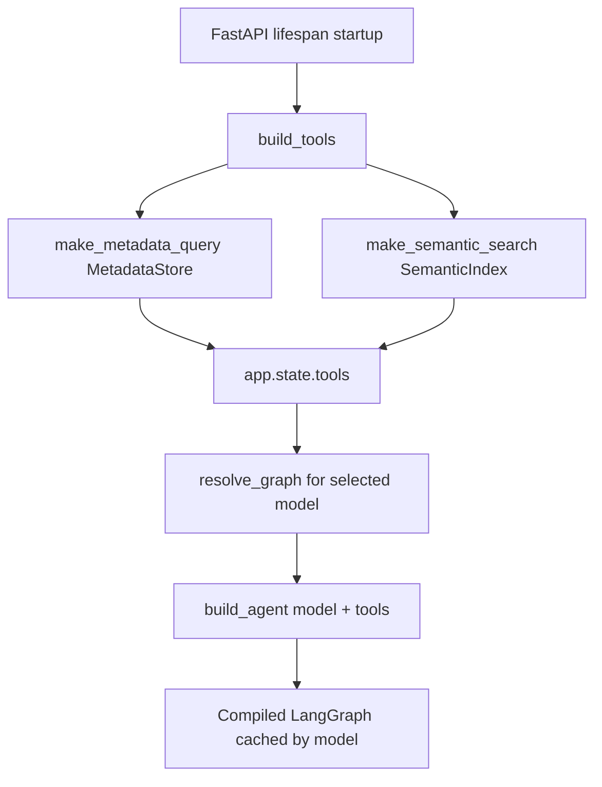
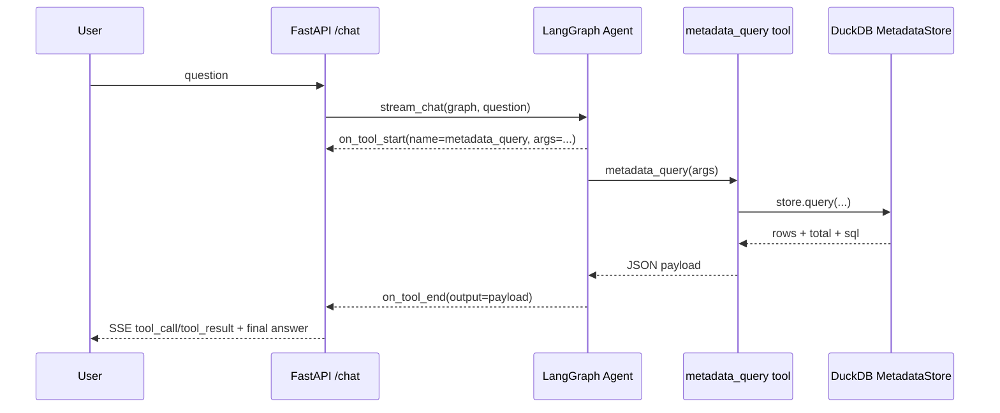

# metadata_query and Agent Graph Integration

This document explains how `metadata_query` is created, registered with the agent,
invoked at runtime, and surfaced in the chat trace.

## 1) Where metadata_query is created

The tool is defined in [core/tools.py](../core/tools.py):

- `make_metadata_query(store)` is a factory that closes over a `MetadataStore`.
- Inside it, `metadata_query(...)` is decorated with `@tool` (LangChain tool).
- The function delegates to `store.query(...)` and returns JSON.

In short: the LLM never writes SQL. It only supplies typed arguments to
`metadata_query`, and `MetadataStore` builds and executes SQL safely.

## 2) How it is connected to the agent graph

At API startup, tools are built once and stored on app state.

1. `build_tools(settings)` creates:
   - `SemanticIndex`
   - `MetadataStore(Path(settings.duckdb_path))`
   - tools list: `[semantic_search, metadata_query]`
2. In FastAPI `lifespan`, `app.state.tools = build_tools(settings)`.
3. On first chat use for a model, `resolve_graph(...)` compiles a graph via:
   - `build_agent(init_chat_model(spec), app.state.tools)`

So `metadata_query` is part of the graph toolset from the moment the graph is
compiled, and that graph is cached per chat model.

## 3) When metadata_query is called

`metadata_query` is called during a chat turn only if the model chooses it.

Runtime flow:

1. Client calls `POST /chat`.
2. API gets graph via `resolve_graph(...)`.
3. `stream_chat(...)` runs `graph.astream_events(...)`.
4. If model decides to call `metadata_query`, LangGraph emits:
   - `on_tool_start` with tool name and args
   - `on_tool_end` with tool result
5. The SSE trace forwards these as `tool_call` and `tool_result` events.

The system prompt in [core/agent.py](../core/agent.py) strongly routes questions
like counts, date ranges, and groupings to `metadata_query`.

## 4) What metadata_query executes internally

`MetadataStore.query(...)` in [core/metadata.py](../core/metadata.py):

- clamps `limit` to `1..50`
- builds a parameterized `WHERE` clause via `_build_where(...)`
- runs one `total` count query and one result query
- supports grouped queries: `month`, `year`, `topic`, `category`
- supports listing mode (paper rows with `arxiv_id`, `title`, etc.)
- retries briefly on DuckDB single-writer lock and returns a graceful error payload

Important behavior:

- `group_by=topic` uses `unnest(topics)`, so grouped topic totals can exceed
  `total` because one paper can have multiple topics.
- `sql` is returned in the tool payload for trace transparency.

## 5) Trace visibility and citation grounding

In [core/agent.py](../core/agent.py):

- `_summarize_tool_payload(...)` recognizes metadata payloads and emits compact
  trace summaries (`total`, optional SQL, groups or evidence rows).
- `_evidence_titles(...)` reads `rows` from tool payloads to map
  `arxiv_id -> title`.
- `_ground_citations(...)` only keeps citations that appeared in tool evidence.

This is why metadata-listed papers can be cited in final answers and shown as
grounded evidence.

## 6) Test coverage for this path

[tests/test_metadata.py](../tests/test_metadata.py) covers:

- SQL building and execution behavior of `MetadataStore.query`
- limit clamping and sort/group variants
- graceful degradation when store is unavailable
- tool call args preserved in graph state (`test_tool_args_ride_the_agent_state`)
- SQL included in tool output for trace (`test_tool_returns_sql_for_the_trace`)

## 7) Quick debug checklist

If `metadata_query` is not being used when expected:

1. Confirm question type is analytical (count/date/group/list) not conceptual.
2. Check SSE events for `tool_call` with `name=metadata_query`.
3. Inspect tool result summary for `total`, `rows`, `sql`, or `error`.
4. Verify DuckDB path from settings points to a populated store.
5. If ingest is running, retry after lock contention clears.
